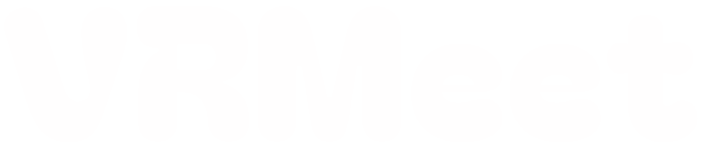

# VRMeet




必要なものはWebカメラだけ。Web上で手軽に複数人での3Dコラボを行うことができます。体を動かして遊ぶパーティーゲーム等の配信にもぴったりです。
# DEMO


# Features
- Webカメラだけで簡単に姿勢を推定してVRMモデルに反映
- SkyWayを用いた複数人でのモーションデータの同期
- 最大3人までのルーム作成機能
- VRMモデルのアップロード機能

# Usage

依存ライブラリのインストール。
```
yarn install
```

必要な認証情報を.env.localに記載。
```
SKYWAY_APP_ID=
SKYWAY_SECRET_KEY=

NEXT_PUBLIC_SUPABASE_URL=
NEXT_PUBLIC_SUPABASE_ANON_KEY=
```

開発サーバーの起動。
```
yarn run dev
```

# License 
VRMeet is under [MIT license](https://github.com/marukun712/VRMeet/blob/main/LICENSE).